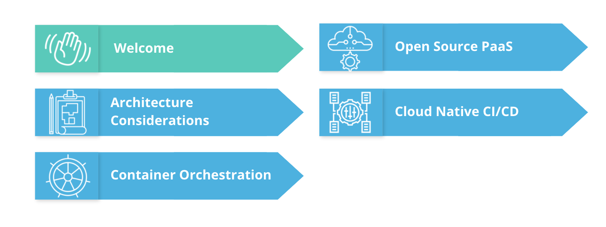
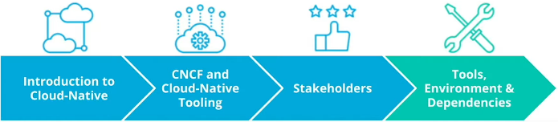

# Course Outline

Throughout the course, we will walk through a realistic example of applying good development practices and containerizing an application, before it's released to a Kubernetes cluster using an automated CI/CD pipeline.

We will start of the:  

1. **Introduction to MicroServices** with an overview of the Cloud-Native ecosystem.
2. We will cover **Architectural Model** wile developing an application. You will learn about design patterns such as **monolith** and **micro-services** and best practice to adapt at the **implementation** stage to **optimize** an application.
3. We will explore *package* an *application* using Docker and deploy it to a **Kubernetes** cluster using  imperative and declarative configuration.
We will Also cover how to deploy **Kubernetes cluster** using **K3s**.
4. We will evaluate Platform as a Service **(PaaS)** solutions and how we can use Cloud Foundry to deploy an application without worrying about the underlying *infrastructure*.
5. We will learn how to use Cloud-Native tooling to construct a **CI/CD pipeline**.
We will deep-dive into GitHub *actions* and *Agro Cd* as deployment mechanisms and explore **template configuration managers** such as Helm.

## Lesson Outline

In the first lesson, we will cover:

1. Introduction to Cloud Native
2. CNCF and Cloud Native tooling
3. Stakeholders
4. Tools, Environment & Dependencies
