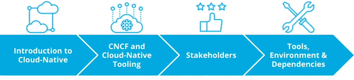

# Summary

In the first lesson, we went through:

* Introduction to Cloud Native
* CNCF and Cloud Native tooling
* Stakeholders
* Tools, Environment & Dependencies

Every organization aims to succeed! This is represented by providing customer value and the ability to be responsive to the surrounding ecosystem. Coincidentally, this is closely correlated with technological innovation, which translates into the adoption of containers, automation, and usage of cloud-native tooling.

By completing this course you will be equipped to lead the adoption of cloud-native tooling and principles within an organization.
