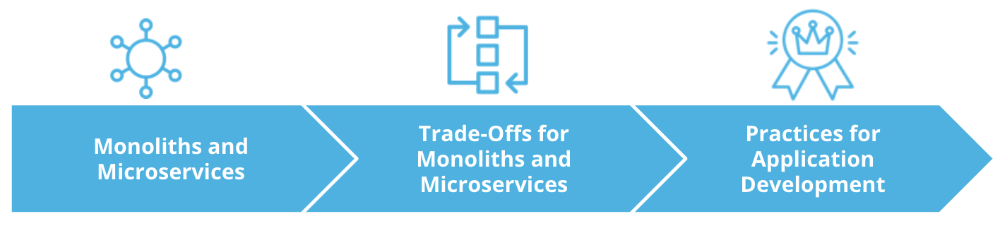

# Introduction

Before building an application, it is common to go through a design phase to identify the main requirements and structure of an application. In correlation with the available resources, a team will choose the most suitable project architecture.

In the industry, usually, the two main approaches that are usually referenced are **monoliths** and **micro** services.

In this lesson, we will explore each architectural model and the implied trade-offs. In addition, we will go through best practice to adopt at the implementation stage, to optimize the **visibility**, **management** and **troubleshooting** of an application.

## Lesson Outline

In this lesson, we will cover:

* We will cover to structure a project using **Monoliths** and **Micros** base architectures.
We will also examine requirements and available resources can define which architecture is most suitable for your project.
* **Trade-offs** for Monoliths and Micro services, and reflect on how these trade-offs can impact the design of an application and its road map
* Will Learn best practices for Application Development. These best practices are relevant for both Monolith and Micro architectures, as focus on optimization of **visibility,** **management** and **troubleshooting** of an application

By the end of this lesson we will be able to evaluate the most **suitable** architecture for an application, considering **functional requireements,** **available resources,** and time frame.