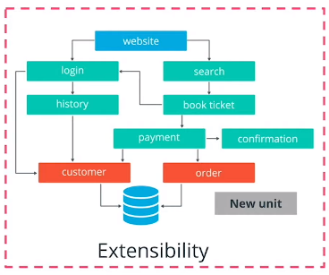

# Edge Case: Amorphous Applications

## Amorphous Applications Structure

. After an engineering team has successfully released a product, with both monolith and micro services, the next phase in the application lifecycle is **maintenance.** In this edge case, we will explore commonly used maintenance operations after a product is released.

In maintenance phase, the product need to be **adjusted** and **extended** with new functionalities.

With micro services, we can easily add a new unit and extend the horizon of application capabilities.

However, with monoliths, we might require to introduce an entire abstraction layer, making sure tht the application can handle new services.

**Note:**
In general, it is always a good principle to focus on **extensibility** rather than **flexibility**. That means  it is more efficient to manage multiple services with a well-defined and simple functionality (as in the case of **micro services**), rather than add more abstraction layers to support new services (as we’ve seen with the **monoliths**).

## Amorphous Applications

Extensibility and flexibility should be in constant consideration by the application developers. The project architecture is not a static manifest.

* It **evolves** and it **grows** based on the user feedback and recurring feedback iterations.
* Consequently , the structure of the project is amorphous and it is in constant movement.

Some of the most encountered operations in the maintenance phase are listed below:

* A **split** operation - is applied if a service covers too many functionalities and it's complex to manage. Having smaller, manageable units is preferred in this context.
* A **merge** operation- is applied if units are too granular or perform closely interlinked operations, and it provides a development advantage to merge these together. For example, merging 2 separate services for log output and log format in a single service.
**Note:** It provides little development advantage to have this union segregated. Hence a merge of these functionalities is beneficial.
* A **replace** operation - is adopted when a more efficient implementation is identified for a service. For example, rewriting a unit using a programing language or library, to optimize the overall execution time.
* A **stale** operation - is performed for services that are no longer providing any business value, and should be archived or deprecated. For example, services that were used to perform a one-off migration process.

Performing any of these operations will increase the **longevity** and **continuity** of a project. But more importantly,you can observe that the structure of a project, it's not static. It's amorphous and it evolves based on the new requirements and customer.

**Further reading**:
 [Modern Banking in 1500 Micro services](https://www.youtube.com/watch?v=t7iVCIYQbgk&ab_channel=InfoQ)- watch how Monzo is managing thousands of micro services and evolves their ecosystem
