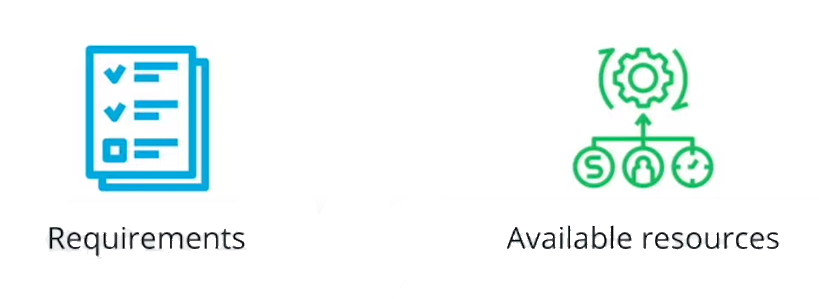

# Design Considerations for Cloud-Native Applications

When building an application it is important to allocate **time** for **context** discovery that help us ==define the overall **structure** and design of the **components.**==
This practice enables the build out of maintainable projects where new **features** can be added with minimal engineering effort.

1. The first step in the context discovery process is to list the **functional requirements,** or what application capabilities should deliver to the end-users. For example, a good starting point is to expand on the following:

2. List all the **available resources** that will help the **implementation** of the project,

These **two** data points will contrary the application architecture, making it easier to choose between the **monoliths** and **micro services** based architecture.

## Requirements

For context discovering, it is paramount to **gather** and **understand** business requirements, what **functionality** should be implemented and for whom. For example, a good starting point is to answer question like

* Who are **Stakeholders:**
Identifying the personas that require and sponsor this application.
For e.g. The marketing team requiring a new tool to customize notification for customers
* What **Functionalities** are needed:
* Who are **End** users:
For e.g. Is it an internal tool for employees or it is customer facing application
* How **Input** and **output** process:
Should the application send a notification as a part of the **output** or does it require any customer detail to execute successfully?
* Engineering teams
Understanding which teams has the skills and time frame to implement the project.

## Available Resources

It is equally important to define the available resources for an organization or what can facilitates or block the product release.

For example, a good starting point is to list available:

* Engineering resources
Number of engineers that can work on the project
* Financial resources
How much can the business spend to ensure a successful release of the product.
* TimeFrames
To define if there is an urgency to reach the market
* Internal knowledge
Of programming language or tool which can facilitate the development of an application.

**Note:** Having a good understanding of functional requirements and available resources can lead to a simpler choice between monolithic and micro service based architectures.