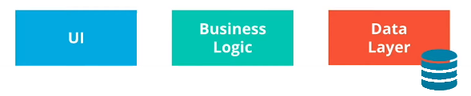

# Monoliths and MicroServices

Once we collected and analyzed the application requirements and available resources, we can move to **design** phase.
In this phase we will choose the most suitable **Application Architecture**.

==We will cover how a simple booking application can be designed using both **Monoliths** and **MicroServices** based models.==

## Application Architecture

In most of the cases 2 distinct models are referenced: monoliths and micro services.

Regardless of the adopted structure, the main goal is to design an application that delivers value to customers and can be easily adjusted to accommodate new functionalities

 **Application Tiers**:

At a macro level, an application is composed of three main tiers or an architecture encapsulates the 3 main tiers of an application:

* **UI** (User Interface) - handles HTTP requests from the users and returns a response
* **Business logic** - represents a collection of functionalities that provides a service to the customer.
* **Data layer** - implements access and storage of data objects through our application execution, buy using database

### Monoliths

In a monolithic architecture, application tiers can be described as:

* part of the same units
* all business logic functions are:
  * managed in a single repository
  * sharing same resources (e.g. CPU and memory)
  * developed in one programming language
* The **packaging,** **distribution** and  **deployment** of a monolith application are  represented by a single artifact or binary, which will include the code for entire  **stack**.

**E.g**: Imagine we are developing a booking application using a monolithic approach.

* In this case, the UI is the website that the user interacts with.
* The business logic contains the code that provides the booking functionalities, such as search, booking, payment, and so on. This functions are managed together in:
  * Single repository.
  * Using one programming language (e.g. Java or Go) 
* The data layer contains functions that store and retrieve customer data.

**Note**: All of these components are managed as a unit, and the release is done using a single binary.

### MicroServices

The MicroServices approach aims to breakdown the application into:

* **smaller,** **independent** units.
* Each functionality represents a separate service containing
  * Its **Logic** and its own allocated **resources** (e.g. CPU and memory)
  * Each service exposes well-defined **API** (Application Programming Interface) for *interaction* and *communication* with other available units
  * Every unit is implemented using the **programming language** of choice. This enables concurrent development cycles as multiple team can work on building multiple services at the same time
  * Each service is composed of a separate repository with its own **binary** that contains the code and the dependencies for that unit alone.

**E.g**: Imagine we are developing a booking application using a **micro Services** approach.

* In this case, the UI remains the website that the user interacts with
* Business logic is decomposed of many independents units
  * login
  * payment
  * confirmation
  * and many more....
* Each services is written in its own programming language (e.g. Go for the payment service and Python for login service).
* To interact with other services, each unit exposes an API.
* And lastly, the data layer contains functions that store and retrieve customer and order data.
**Note:** As expected, each unit has its own repository and it will be deployed using its own binary.

## Architecture Consideration

Choosing an architecture for an application is highly impacted by the functional requirements and available resources.

**Functional Requirements:**

* Product features
* Stake holders
* Dependencies

**Available Resources:**

* Engineering Teams
* Time Frames
* Finances
* Internal Knowledge o a Programming Language or Tool

**New Terms**:

* **Monolith:** application design where all application tiers are managed as a single unit
  
* **MicroService:** application design where application tiers are managed as independent, smaller units

**Further reading**:

* [What’s the Difference Between Monolith and MicroServices?](https://nordicapis.com/whats-the-difference-between-monolith-and-microservices/)
* [MicroServices vs Monolithic Architecture](https://www.mulesoft.com/resources/api/microservices-vs-monolithic)
