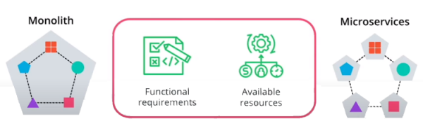
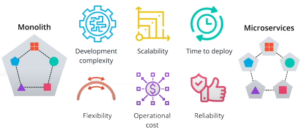

# Trade-offs for Monoliths and Microservices

Each approach Monoliths and and MicroServices has a set of trade-offs that need to be considered thoroughly as this will impact the longevity of the project.

## Two Sides of The Same Coin

1. Functional Requirements and Available Resources

2. Other Trade-off implied by each architecture
   1. Development Complexity
   2. Scalability
   3. Time to deploy
   4. Flexibility
   5. Operational Cost
   6. Reliability

### Trade-Off

#### Development Complexity

  Monoliths                                   | MicroServices
  :------------                               | :----------
  **One** Language or Framework               | **Multiple** Languages
  Can be stored in **One** Repository         | Each micro services require its own separate codebase.    Means **Multiple** Repositories required.
  The development is **sequential**, usually a release requiring changes to multiple functionalities to ensure backward compatibility | Each team can work on functionality dependently in **concurrent** manner.

#### Scalability

Scalability captures how an application scale is under load. For example, observing the application behavior when  incoming request are increasing exponentially, or there is sudden demand in one particular service.

  Monoliths                                   | MicroServices
  :------------                               | :----------
  Replication of the **entire stack** with all the functionalities.   As such, in case of Web Store, when payment service needs to be scaled, we would also have to scale customer login, order shipping other components | Replication of **separate functionalities**
  This is heavy on the resource **consumptions** such as CPU and memory,         | **On-demand** resource consumption.

#### Time to deploy

It refers to the ability to build a delivery pipeline and ship features.

  Monoliths                                   | MicroServices
  :------------                               | :----------
  **One** delivery pipeline is required as all components are developed in the same code repository.  | **Multiple** delivery pipeline, usually coincides with one pipeline per code base.
  **Entire** stack deployment.   This can be disastrous if a release fails as it will take down the entire application.  There is a higher risk of violating the zero downtime principle.| **Separate** function deployment without affecting the availability of our components.  There is less risk to tae down the entire application within your release
  **Low** velocity at scale | Allow **high** velocity of feature development as we can have more releases with less risk

#### Flexibility

Flexibility implies the ability to adapt to new technologies and introduce new functionalities.

  Monoliths                                   | MicroServices
  :------------                               | :----------
  **Low** rate, since the entire application stack might need restructuring to incorporate new functionalities | **High** rate, as micro services are purposely built to be loosely coupled and allows independent changes to services, **Re-writing** or **re-designing** one functionality is more achievable than re-designing the entire stack.

#### Operational Cost

Operational cost represents the cost of necessary resources to build, deploy and release a product.

  Monoliths                                   | MicroServices
  :------------                               | :----------
   **Low** initial cost, since one code base and one pipeline should be managed. | **High** initial cost, since multiple repositories and pipelines require management.
   **High** cost at scale, as it imposes more complexity and it will consume more resources when replicated. | The operational cost is **low** at scale, as operational cost is directly proportional to the required resources at the time.  Scalability is perform individually per unit and adding new components is a defacto operation.  

#### Reliability

Reliability captures practices for an application to recover from failure and tools to monitor an application.

  Monoliths                                   | MicroServices
  :------------                               | :----------
  The **entire** stack will need to be troubleshooted and recovered | Recovery of **failed components** only
  **Low** visibility into logs and metrics, since all log and metrics are aggregated together. | **High** visibility into the  metrics and logs of a separate unit

## Conclusion

Each approach Monoliths and and MicroServices has a set of trade-offs that need to be considered when you start a project and maintain it.
However,  it is to truly understand the application requirements when choosing an architecture as this will define the best approach.

There is no "golden path" to design a product, but a good understanding of the trade-offs will provide a clear project road map that enforces extensibility and optimization.
Regardless if a monolith or micro service architecture is chosen, as long as the project is coupled with an efficient delivery pipeline, the ability to adopt new technologies, and easily add features, the path to could-native deployment is certain.