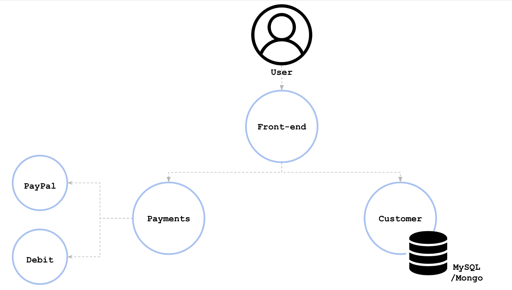

# Exercise: Trade-offs for Monoliths and Micro services

**Outline the architecture of an application:**

From the early stages of application development, it is fundamental to understand the requirements and available resources. Overall, these will contour the architecture decisions.

Imagine this scenario: you are part of the team that needs to outline the structure of a centralized system to book flight tickets for different airlines. At this stage, the clients require *the front-end(UI), payment, and customer functionalities to be designed*. Also, these are the *individual requirements* of each airline:

* **Airline A** - payments should be allowed only through PayPal
* **Airline B** - payments should be disabled (bookings will be exclusively in person or via telephone)
* **Airline C** - payments should be allowed to use PayPal and debit cards

Using the above requirements, outline the application architecture. Also, elaborate your reasoning on choosing a micro service or monolith based approach.

**Answer:**

Given the scenario, it is paramount to choose an architecture that would be **replicable** and **scalable.** For example, if thousands of customers access the payment service in the same time frame, then this particular service should be scaled up. In a monolith architecture, scaling up creates a replica of everything, including front-end and customer services, in addition to the payment service. This will also consume more resources on the platform, such as CPU and memory, and takes longer to spin up.

On the other side, a micro service is a lightweight component that requires fewer resources (CPU and memory) and less time for provisioning.

For this example, a micro service-based architecture is chosen, based on considerations that the application is a central booking system for multiple airlines, that implies a high load. The main components are:

* Front-end - entry-point for the user, where they will choose their airline or choice
* Customer - requires a database (MySQL or Mongo) to store the customer details
* Payments - to implement PayPal and Debit based operations

Additionally, the "payments" micro service is capable of handling multiple payment systems. Interaction with the PayPal interface and management of debit card APIs are fundamentally different. The "payments" component is a monolith that can be divided into multiple parts.

Payments:

* PayPal - handling all the PayPal payments
* Debit - handling all the debit card payments

