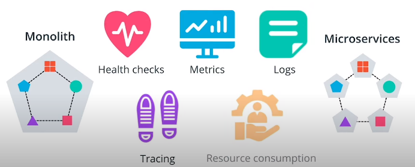
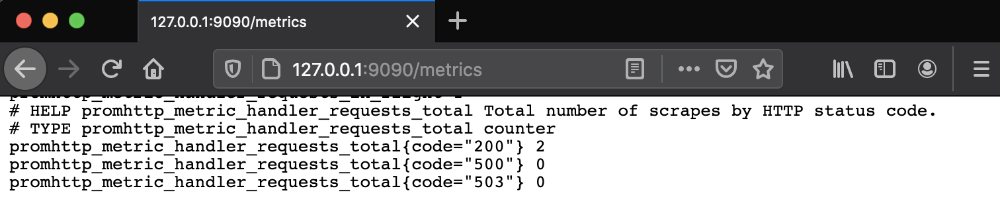
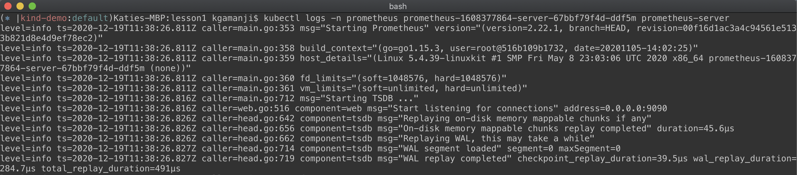

# Best Practices For Application Deployment

We will go thorough the best practices to use when developing an application that aims to be containerized.

## Best Practices

These practices are focused on health checks, metrics, logs, tracing, and resource consumption.
The purposes of these practices is to increase visibility and improve consumption for a service.

### Health Checks

* Health checks are implemented to showcase the **status** of an application.
* Usually, health checks are represented by an HTTP endpoint such as `/healthz` or `/status`
* These endpoints return an HTTP **response** showcasing if the application is
  * `result: "healthy"`
  * `result: "error"`

### Metrics

Metrics are necessary to understand the behavior of an application.  

* Statistics should be gathered for individual services as it will increase the visibility of what resources tha application requires to be fully operational, For Example:
  * Amount of CPU
  * Amount of memory used
  * Network Throughput.
* A service can report on the number of resources it is capable to handle, For example:
  * Amount of requests
  * Active users or the amount of logins.
* Usually, the metrics are consumed via an HTTP endpoint such as `/metrics`, winch returns the statistics for the services, for example:
  * `result: {"UserCount":140, "UsersCountActive":23}`

### Logs

It is the nucleus of any troubleshooting and debugging process. Logs are used to:

* Record **operations** that are performed by a service, for example:
  * User **logged** in successfully into a service
  * User encountered an **error** while performing a payment or or any other function.
* In case of error, it return **response**.
  * `{"date":"2021-01-01 02:10:12, "severity":"ERROR","msg":"Login failes for user FOO" "}`
* Logs are collected from (standard out) and STDERR (standard error) through a **passive** logging mechanism. This means that any output or errors from the application are sent to the shell. Subsequently, these are collected by a logging tool, such as `Fluentd` or `Splunk`, and stored in backend storage.
* The application can send the logs directly to the backend storage or database by using **active** logging technique, as the log transmission is handled directly by the application, without a logging tool required.

There are multiple logging levels that can be attributed to an operation. Some of the most widely used are:

* **DEBUG** - record fine-grained events of application processes
* **INFO** - provide coarse-grained information about an operation
* **WARN** - records a potential issue with the service
* **ERROR** - notifies an error has been encountered, however, the application is still running
* **FATAL** - represents a critical situation, when the application is not operational

As well, it is common practice to associate each log line with a timestamp, that will exactly record when an operation was invoked.

### Tracing

Tracing is capable of creating a full picture of how different services are invoked to fulfill a single request.
With tracing library integrated, it is possible to:

* Recreate and analyze the **life cycle** for request and identify key metrics within an application.
* Tracing is implemented at the **application** layer, where the developer will able to record when a function is invoked.

### Resource Consumption

* Resource Consumption refers to the amount of **CPU** and **memory** an application requires to be fully operational.
  * Return response
    * CPU: 1
    * memory: 256
* Resource consumption also includes the network throughput as well, making sure that the application has enough bandwidth to handle multiple requests.
  * Return response
    * 100 Mb/s

Having awareness of resource boundaries is essential to ensure that the application is up and running 24/7

**Further reading**:

* [Health Checks](https://microservices.io/patterns/observability/health-check-api.html) - explore the core reasons to introduce health checks and implementations examples
* [Prometheus Best Practices on Metrics Naming](https://prometheus.io/docs/instrumenting/writing_exporters/#metrics) - explore how to name, label, and define the type of metrics
* [Application Logging Best Practices](https://logz.io/blog/logging-best-practices/) - explore the core reasons to introduce health checks and implementations examples
* [Logging Levels](https://www.tutorialspoint.com/log4j/log4j_logging_levels.htm) - explore how to name, label, and define the type of metrics
* [Enabling Distributed Tracing for Micro services With Jaeger in Kubernetes](https://containerjournal.com/topics/container-ecosystems/enabling-distributed-tracing-for-microservices-with-jaeger-in-kubernetes/) - explore how to name, label, and define the type of metrics
