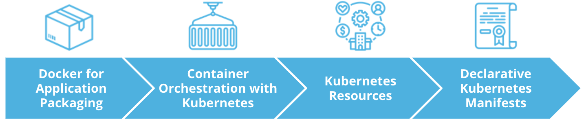

# Introduction

Developing an application is just one step towards market and end-user outreach.
Next phase is represented by the release process. This includes techniques for service packaging, containerization, and distribution.

Overall, in this lesson we will explore:

* Docker for Application Packaging
* Container Orchestration with Kubernetes
* Kubernetes Resources
* Declarative Kubernetes

