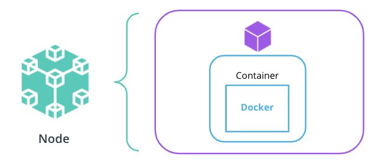

# Kubernetes Resources Part 1

In this section we explore how to deploy an application to cluster.

Kubernetes provides a rich collection of resources that are used to deploy, configure, and manage an application. Some of the widely used resources are:

* Pods - Provides the context for the application to execute
* Deployments & ReplicaSets - Used to manage a collection of pods
* Services & Ingress - Ensure connectivity to a collection of pods
* Configmaps & Secrets - Pass configuration to pods
* Namespaces - Provide logical separation between multiple applications and their resources.
* Custom Resource Definition (CRD) - Provides a boiler plate to extend Kubernetes API and create resources that can fully match your application pattern.

## Application Deployment

### Pods

These are the smallest deployable units that can be managed in Kubernetes.

Usually, every pod has a container within it. The container will run the application based on an OCI compliant image. For example, a Docker image with the Python Hello World application.



There are use cases where 2-3 containers run within the same pod, however, it is highly recommended to keep the 1:1 ratio between your pods and containers.

**Note:** All the pods are placed on the cluster nodes. A node can host multiple pods for different applications.

### Deployments and ReplicaSets


To deploy an application to a Kubernetes cluster, a **Deployment** resource is necessary. This will described the desire state of configuration, and the cluster controllers will, ensure that any differences are reconciled.

The Deployment resource manages pods by  using a **ReplicaSet**. A ReplicaSet resource ensures that the desired amount of pods are up and running at all times.

To create a deployment, use the `kubectl create deployment`command, with the following syntax:

``` bash

# create a Deployment resource
# NAME - required; set the name of the deployment
# IMAGE - required;  specify the Docker image to be executed
# FLAGS - optional; provide extra configuration parameters for the resource
# COMMAND and args - optional; instruct the container to run specific commands when it starts 
kubectl create deploy NAME --image=image [FLAGS] -- [COMMAND] [args]

# Some of the widely used FLAGS are:
-r, --replicas - set the number of replicas
-n, --namespace - set the namespace to run
--port - expose the container port
```

For example, to create a Deployment for the Go hello-world application, the following command can be used:

``` bash

# create a go-helloworld Deployment in namespace `test`
kubectl create deploy go-helloworld --image=pixelpotato/go-helloworld:v1.0.0 -n test
```

**Note:** It is possible to create headless pods or pods that are not managed through a ReplicaSet and Deployment.  Though it is not recommended to create standalone pods, these are useful only when creating a testing pod.

To create a headless pod, the `kubectl run` command is handy, with the following syntax:

``` bash

# create a headless pod
# NAME - required; set the name of the pod
# IMAGE - required;  specify the Docker image to be executed
# FLAGS - optional; provide extra configuration parameters for the resource
# COMMAND and args - optional; instruct the container to run specific commands when it starts 
kubectl run NAME --image=image [FLAGS] -- [COMMAND] [args...]

# Some of the widely used FLAGS are:
--restart - set the restart policy. Options [Always, OnFailure, Never]
--dry-run - dry run the command. Options [none, client, server]
-it - open an interactive shell to the container
```

For example, to create a busybox pod, the following command can be used:

``` bash

# example: create a busybox pod, with an interactive shell and a restart policy set to Never 
kubectl run -it busybox-test --image=busybox --restart=Never
```

### Rolling Out Strategy

The Deployment resource comes with a very powerful rolling out strategy, which ensures that no downtime is encountered when a new version of the application is released. Currently, there are 2 rolling out strategies:

* **RollingUpdate** - updates the pods in a rolling out fashion (e.g. 1-by-1)
* **Recreate** - kills all existing pods before new ones are created

For example, we upgrade a Go hello-world application from version 1.0.0 to version 2.0.0:


Where:

1. The Go hello-world application is running version v1.0.0 in a pod managed by a ReplicaSet
2. The version of Go hello-world application is set to v2.0.0
3. A new ReplicaSet is created that controls a new pod with the application running in version v2.0.0
4. The traffic is directed to the pod running v2.0.0 and the pod with the old configuration (v1.0.0) is removed

### Useful Commands

``` bash
# get Deployments, ReplicaSets and Pods

$ kubectl get deploy
$ kubectl get rsk
$ kubectl get po
```

``` bash
# edit deployment
# it edits a Kubernetes resource, and you can pass the `-o` yaml to set edit structure to YAML 

$ kubectl edit deploy {{ NAME }} -o yaml
```

``` bash

# access an application locally
# Its is usefull command to access an appliaction on the local host by exposing the container port.

kubectl port-forward {{RESOURCE}} {{PORTS}}
```

**New terms:**

* **Pod** - smallest manageable unit within a cluster that provides the execution environment for an application
* **ReplicaSet** - a mechanism to ensure a number of pod replicas are up and running at all times
* **Deployment** - describe the desired state of the application to be deployed

**Further Reading:**
Explore the Kubernetes resources in more detail:

* [Kubernetes Pods](https://kubernetes.io/docs/concepts/workloads/pods/)
* [Kubernetes Deployments](https://kubernetes.io/docs/concepts/workloads/controllers/deployment/)
* [Kubernetes ReplicaSets](https://kubernetes.io/docs/concepts/workloads/controllers/replicaset/)
* [Kubernetes RollingOut Strategies](https://kubernetes.io/docs/concepts/workloads/controllers/deployment/#strategy)
