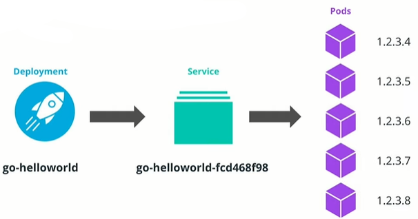
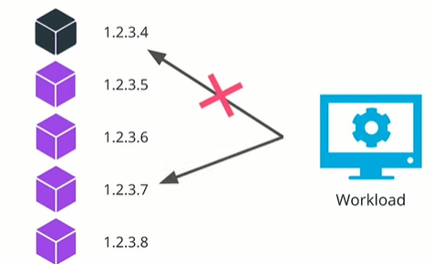
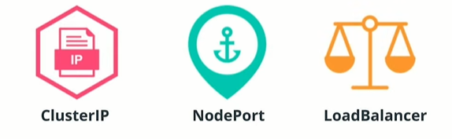

# Kubernetes Resources Part 2

## Application Reachability

Within a cluster, every pod is allocated 1 unique IP which ensures connectivity and reachability to the application inside the pod. This IP is only routable inside the cluster, meaning that external users and services will not be able to connect to the application.

**Note:** It is not worthy that this IP will not be routable outside of the cluster and the user will be able to access it only from within the cluster.

For example, we have five Pods and each point has unique IP that other services within the cluster can use and access these pods.



Supposedly, we connect to workload to one of our five pods by using its IP. If the pod dies, all future requests will fail, as these are routes to an application that is not running. To fix this, we configure the workload to talk to a different pod IP.
This is a highly manual process which brings complexity to the accessibility of an application.



To solve this Kubernetes introduces Service Resource.

### Services


A Service resource provides an abstraction layer across all pod IPs by issuing service IP and making sure that traffic is routed to the pods that are up and running.

As such, as shown in the above image, instead of accessing each pod independently, the workload (1) should access the service IP (2), which routes the requests to available pods (3).

There are 3 widely used Service types:



* **ClusterIP** - exposes the service using an internal cluster IP. This IP is accessible only inside the cluster, so workload can refer to it securely. If no service type is specified, a ClusterIP service is created by default.
* **NodePort** - expose the service using a port exposed on the node. All the nodes in the cluster will expose the same port and route the traffic to the application.
* **LoadBalancer** - exposes the service through a load balancer from a public cloud provider such as AWS, Azure, or GCP. This will allow the external traffic to reach the services within the cluster securely.

To create a service for an existing deployment, use the `kubectl expose deployment` command, with the following syntax:

``` bash


# expose a Deployment through a Service resource 
# NAME - required; set the name of the deployment to be exposed
# --port - required; specify the port that the service should serve on
# --target-port - optional; specify the port on the container that the service should direct traffic to
# FLAGS - optional; provide extra configuration parameters for the service
kubectl expose deploy NAME --port=port [--target-port=port] [FLAGS]

# Some of the widely used FLAGS are:
--protocol - set the network protocol. Options [TCP|UDP|SCTP] #TCP is default value
--type - set the type of service. Options [ClusterIP, NodePort, LoadBalancer]
```

For example, to expose the Go hello-world application through a service, the following command can be used:

``` bash

# expose the `go-helloworld` deployment on port 8111
# note: the application is serving requests on port 6112
kubectl expose deploy go-helloworld --port=8111 --target-port=6112
```

### Ingress


However, having an actual load balance per application is extremely expensive as cloud providers charge quite high for these resources.

It is most common to allocate a load balancer per business vertical or a function which will direct the traffic to multiple applications

The  configuration of external traffic to services within cluster is done through an Ingress resource. An Ingress exposes HTTP and HTTPS routes such as go-helloworld.com/hi and subsequently directs the traffic to the go-helloworld service within the cluster. The routing is done based on the rules configured within the Ingress resource.

For Ingress to be implemented successfully, an Ingress controller is required. This will manage and keep the load balancer up to date with the defined rules within the Ingress resource.

**Further Reading:**

* **Service** - an abstraction layer over a collection of pods running an application
* **Ingress** - a mechanism to manage the access from external users and workloads to the services within the cluster

**Further Reading:**
Explore Kubernetes resources used to connect to an application:

* [Kubernetes Services](https://kubernetes.io/docs/concepts/services-networking/service/)
* [Kubernetes Ingress](https://kubernetes.io/docs/concepts/services-networking/ingress/)