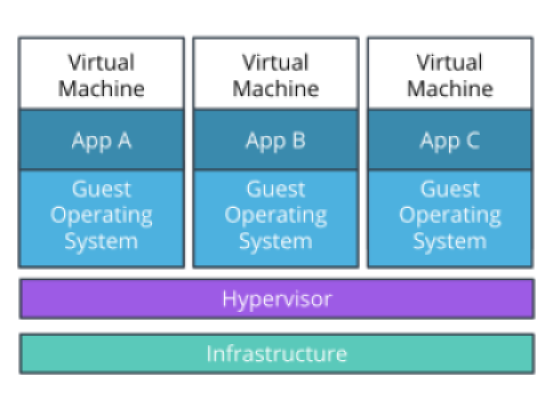

# Transitions from VMs to Containers

## VMs

In the past years, VMs (Virtual Machines) were the main mechanism to host an application. VMs encapsulate the code, configuration files, and dependencies necessary to execute the application.

In essence, a VM is composed of an **operating system** (OS) with a set of pre-installed libraries and packages. During execution, an **application** utilizes an OS filesystem, resources, and packages.

A set of VMs is managed through a **hypervisor.** A hypervisor provides the virtualization of the **infrastructure** which is composed of physical servers. As a result, a hypervisor is capable of creating, configuring, and managing multiple VMs on the available servers. For example, we are able to running applications A, B, and C on 3 separate VMs.

This was a great way to introduce:

* standardization and increase efficiency of the available infrastructure.
* Multiple VMs on the same physical machine.
* Replicated OS (**Cons**)
**Note:** Having a full copy of an operating system takes **gigabytes,** and the more applications we run, the more space we allocate to the replication of the operating systems alone

**Note:**
A hypervisor is just a software that creates and runs VMs.

## Containers

There was a clear need to optimize the usage of the available infrastructure. As a result, the virtualization of the **Operating System** was introduced, which facilitated the appearance of containers. It contain bare minimum an application requires for a successful execution e.g. code, config files, and dependencies. By default, there is a better usage of available infrastructure.

Multiple VMs on a hypervisor are replaced by multiple containers running on a single host operating system. The processes in the containers are completely isolated but are able to access the OS filesystem, resources, and packages. The creation and execution of containers is delegated to a container management tool, such as **Docker**.

containers are:

* **lightweight** technique to deliver a product to consumer
* Having better usage of **resources**.
