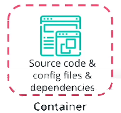
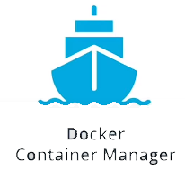
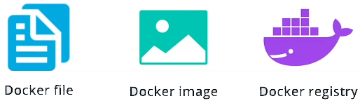

# Docker for Application Packaging

## Docker

Once you have implemented a piece of software, the next phase is to release it. In **containerized** world, you usually starts with

* **Packaging** of an application source code, configuration, and dependencies.
This will produce an artifact tha can be executed in a loosely isolated container.


* To grade multiple containers a container manager is required. In our case we will explore **Docker Container Manager**


## Docker Objects

To containerize an application using Docker, **three** main components are distinguished:

1. Dockerfile
2. Docker images
3. Docker registries



### Dockerfile

A Dockerfile is a

* Set of **instructions** used to
  * Create a Docker **image.**
  * Each instruction is an **operation** used to package the application, such as
    * installing dependencies
    * compile the code
    * impersonate a specific user
  * Each operation will represent a **layer** in the docker image.

**Note:**
The layers are **cached** and if the Docker file is modified, only the layers that are changed will be rebuild. As a result, building a Docker image using a Dockerfile is a **lightweight** and **quick process.**

To construct a Dockerfile, it is necessary to use the pre-defined instructions. These instructions are a step-by-step guide to build a Docker image and run the container successfully.

**Example:**

``` Docker
FROM -  to set the base image
FROM node:alpine
RUN - to execute a command
COPY & ADD  - to copy files from host to the container
CMD - to set the default command to execute when the container starts
EXPOSE - to expose an application port 
```

Below is an example of a Dockerfile that targets to package a Python hello-world application:

``` Docker
# set the base image. Since we're running 
# a Python application a Python base image is used
FROM python:3.8
# set a key-value label for the Docker image
LABEL maintainer="Katie Gamanji"
# copy files from the host to the container filesystem. 
# For example, all the files in the current directory
# to the  `/app` directory in the container
COPY . /app
#  defines the working directory within the container
WORKDIR /app
# run commands within the container. 
# For example, invoke a pip command 
# to install dependencies defined in the requirements.txt file. 
RUN pip install -r requirements.txt
# provide a command to run on container start. 
# For example, start the `app.py` application.
CMD [ "python", "app.py" ]
```

### Docker Image

Once a Dockerfile is constructed, these instructions are used to build a **Docker image**. A Docker image is a

* Read-only template that
  * Enables the creation of a runnable instance of an application.

**Note:** In a nutshell, a Docker image provides the execution environment for an application, including any essential code, config files, and dependencies.

A Docker image can be built from an existing Dockerfile using the `docker build` command. Below is the syntax for this command:

``` Docker
# build an image
# OPTIONS - optional;  define extra configuration
# PATH - required;  sets the location of the Dockefile and  any referenced files 
docker build [OPTIONS] PATH

# Where OPTIONS can be:
-t, --tag - set the name and tag of the image
-f, --file - set the name of the Dockerfile
--build-arg - set build-time variables

# Find all valid options for this command 
docker build --help
```

For example, to build the image of the Python hello-world application from the Dockerfile, the following command can be used:

``` Docker
# build an image using the Dockerfile from the current directory
docker build -t python-helloworld .

# build an image using the Dockerfile from the `lesson1/python-app` directory
docker build -t python-helloworld lesson1/python-app
```

It is paramount to test it locally and verify if it meets the expected behavior. To create a container using an available Docker image, the docker run command is available. Below is the syntax for this command:

```Docker
# execute an image
# OPTIONS - optional;  define extra configuration
# IMAGE -  required; provides the name of the image to be executed
# COMMAND and ARGS - optional; instruct the container to run specific commands when it starts 
docker run [OPTIONS] IMAGE [COMMAND] [ARG...]

# Where OPTIONS can be:
-d, --detach - run in the background 
-p, --publish - expose container port to host
-it - start an interactive shell

# Find all valid options for this command 
docker run --help
```

For example, to run the Python hello-world application, using the created image, the following command can be used:


**Note:** To access the application in a browser, we need to bind the Docker container port to a port on the host or local machine. In this case, `5111` is the host port that we use to access the application e.g. `http://127.0.0.1:5111/`. The `5000` is the container port that the application is listening to for incoming requests.

``` Docker
# run the `python-helloworld` image, in detached mode and expose it on port `5111`
docker run -d -p 5111:5000 python-helloworld
```

To retrieve the Docker container logs use the `docker logs {{ CONTAINER_ID }}` command. For example:

``` Docker
docker logs 95173091eb5e

## Example output from a Flask application
 * Serving Flask app "app" (lazy loading)
 * Environment: production
   WARNING: This is a development server. Do not use it in a production deployment.
   Use a production WSGI server instead.
 * Debug mode: off
```

### Docker Registry

Once we have created and tested  the **Docker image**, the next step is to store it in **Docker registry**. This enable us to access the image on the **other** machines than our local machine.

**Image** registry is an mechanism:

* **Store** Docker images.
* **Distribute** Docker images
* Publicly access Docker image, image needs to be pushed to a **public Docker image registry**, such as:
  * DockerHub
  * Harbor
  * Google Container Registry etc.
* Host **private image registries,** which provides full control over who can access and execute the image.

#### Docker Registry - Tag

Before pushing an image to a Docker registry, it is highly recommended to tag it first. A Tag is used to:

* Tag - **Version** control the application releases as it contains
  * location
  * name
  * version of image

**Note:** During the build stage, if a tag is not provided (via the `-t` or `--tag` flag), then the image would be allocated an ID, which does not have a human-readable format (e.g. 0e5574283393). Hence,we need to prepare an image before it's pushed to the registry and tag it accordingly.

``` Docker
# tag an image
# SOURCE_IMAGE[:TAG]  - required and the tag is optional; define the name of an image on the current machine 
# TARGET_IMAGE[:TAG] -  required and the tag is optional; define the repository, name, and version of an image
docker tag SOURCE_IMAGE[:TAG] TARGET_IMAGE[:TAG]
```

For example, to tag the Python hello-world application, to be pushed to a repository in DockerHub, the following command can be used:

``` Docker
# tag the `python-helloworld` image, to be pushed 
# in the `pixelpotato` repository, with the `python-helloworld` image name
# and version `v1.0.0`
docker tag python-helloworld pixelpotato/python-helloworld:v1.0.0
```

Once the image is tagged, the final step is to push the image to a registry. For this purpose, the docker push command can be used. Below is the syntax for this command:

``` Docker
# push an image to a registry 
# NAME[:TAG] - required and the tag is optional; name, set the image name to be pushed to the registry
docker push NAME[:TAG]
```

For example, to push the Python hello-world application to DockerHub, the following command can be used:

```Docker
# push the `python-helloworld` application in version v1.0.0 
# to the `pixelpotato` repository in DockerHub
docker push pixelpotato/python-helloworld:v1.0.0
```

## Docker: OCI(Open Container Initiative) Compliant Images

By default, Docker will build an OCI Initiative Compliant Images. OCI aims to **standardize** image formats, making sure it can be executed on any OCI compliant **runtime** such as **Docker** or **CRI-O**.

## New Tools

While Docker is most widely used mechanism to generate images, new tools have emerged within the **ecosystem** that provides a **simplified** user experience. Some of new tools are:

* Buildpacks: without Dockerfile
  * It will identify the necessary dependencies for an application and build and image following the best practices.
  * This mechanism **eliminates** the need to have the **Docker Daemon** inside the container to execute the image, and provides an improved  security context as no Docker socket is exposed.
* Podman
* Buildah

**New terms:**

* **Dockerfile** - set of instructions used to create a Docker image
* **Docker image** - a read-only template used to spin up a runnable instance of an application
* **Docker registry** - a central mechanism to store and distribute Docker images

**Further Reading:**

Explore Dockerfile best practices and valid list of instructions:

* [Dockerfile reference](https://docs.docker.com/engine/reference/builder/#from)
* [Best practices for writing Dockerfile](https://docs.docker.com/develop/develop-images/dockerfile_best-practices/)

Explore how to build and run a Docker image, with a list of all available options:

* [Docker Build command](https://docs.docker.com/engine/reference/commandline/build/)
* [Docker Run command](https://docs.docker.com/engine/reference/commandline/run/)

Explore Docker registries, alternatives to package an application, and OCI standards:

* [Introduction to Docker registry](https://docs.docker.com/registry/introduction/)
* [Docker Tag command](https://docs.docker.com/engine/reference/commandline/tag/)
* [Docker Push command](https://docs.docker.com/engine/reference/commandline/push/)
* [Demystifying the Open Container Initiative (OCI) Specifications](https://www.docker.com/blog/demystifying-open-container-initiative-oci-specifications/)
* [Buildpacks: An App’s Brief Journey from Source to Image](https://buildpacks.io/docs/app-journey