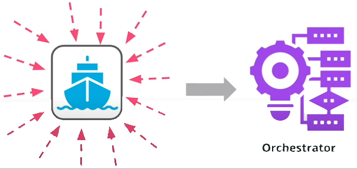
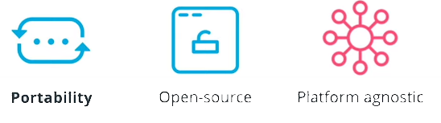
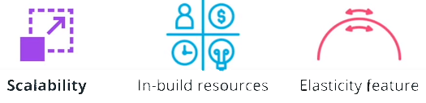

# Kubernetes - The Container Orchestrator Framework

The next phase in the release process is the deployment of the service. However, running an application in production implies that thousands and millions of customers might consume the product at the same time. For this reason, it is paramount to build for scale. It is impossible to manually manage thousands of containers, keeping these are up to date with the latest code changes, in a healthy state, and accessible. As a result, a **container orchestrator framework** is necessary.

## Container Orchestrator

A container orchestrator framework is capable to create, manage, configure thousands of containers on a set of distributed servers while preserving the connectivity and reachability of these containers.

In past years multiple orchestration framework have emerged, such as:

* Docker Swarm
* Apache Mesos
* CoreOS Fleet
* **Kubernetes** etc.

### Kubernetes

 **Kubernetes** took the lead in defining the principles of how to run containerized workloads on a distributed amount of machines.

 Kubernetes is widely adopted in the industry today, with most organizations using it in production, because it is capable of solutionizing:

* **Portability**
Kubernetes is a highly portable tool. This is due to its open-source nature, that resides under **CNCF** umbrella or **Cloud Native Computing Foundation**, and it is graduate project that was build to be **platform agnostic**.  As such, Kubernetes can be hosted on any available infrastructure, including public, private, and hybrid cloud.

* **Scalability**
In the modern infrastructure an application should be able to **scale up** when traffic is high and **scale down** when traffic is low.  Kubernetes has in-build resources, such as **HPA** (Horizontal Pod Autoscaler), to determine the required amount of replicas for a service. Elasticity is a core feature that is highly automated within Kubernetes

* **Resilience**

* **Service Discovery**
* **Extensibility**
* **Operational Cost**

**New terms:**

* **CRD** - Custom Resource Definition provides the ability to extend Kubernetes API and create new resources
* **Node** - a physical or virtual server
* **Cluster** - a collection of distributed nodes that are used to manage and host workloads
* **Master node** - a node from the Kubernetes control plane, that has installed components to make global, cluster-level decisions
* **Worker node** -a node from the Kubernetes data plane, that has installed components to host workloads

**Further Reading:**
Explore Kubernetes features:

* [Kubernetes DNS for Services and Pods](https://kubernetes.io/docs/concepts/services-networking/dns-pod-service/)
* [Kubernetes CRDs](https://kubernetes.io/docs/concepts/extend-kubernetes/api-extension/custom-resources/)

Explore how to build and run a Docker image, with a list of all available options:

* [Kubernetes Cluster Autoscaler](https://kubernetes.io/blog/2016/07/autoscaling-in-kubernetes/)
* [Kubernetes Architecture and Components](https://kubernetes.io/docs/concepts/overview/components/)
