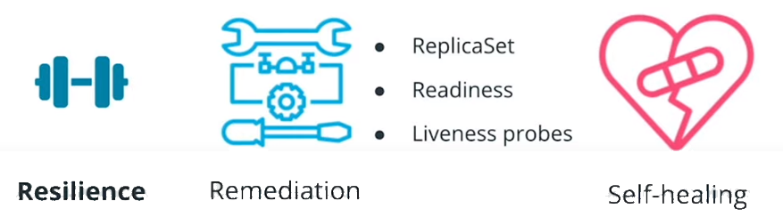
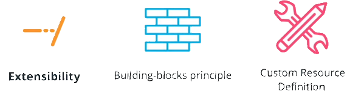
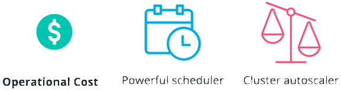
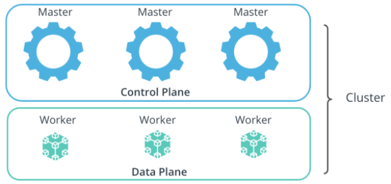
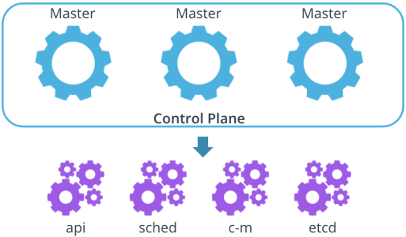
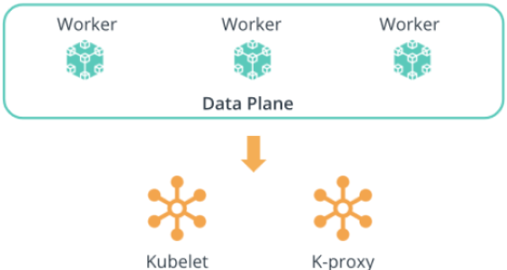

# Kubernetes - The Container Orchestrator Framework

The next phase in the release process is the deployment of the service. However, running an application in production implies that thousands and millions of customers might consume the product at the same time. For this reason, it is paramount to build for scale. It is impossible to manually manage thousands of containers, keeping these are up to date with the latest code changes, in a healthy state, and accessible. As a result, a **container orchestrator framework** is necessary.

## Container Orchestrator

A container orchestrator framework is capable to create, manage, configure thousands of containers on a set of distributed servers while preserving the connectivity and reachability of these containers.

In past years multiple orchestration framework have emerged, such as:

* Docker Swarm
* Apache Mesos
* CoreOS Fleet
* **Kubernetes** etc.

### Kubernetes

 **Kubernetes** took the lead in defining the principles of how to run containerized workloads on a distributed amount of machines.

 Kubernetes is widely adopted in the industry today, with most organizations using it in production, because it is capable of solutionizing:

* **Portability**
Kubernetes is a highly portable tool. This is due to its open-source nature, that resides under **CNCF** umbrella or **Cloud Native Computing Foundation**, and it is graduate project that was build to be **platform agnostic**.  As such, Kubernetes can be hosted on any available infrastructure, including public, private, and hybrid cloud.

* **Scalability**
In the modern infrastructure an application should be able to **scale up** when traffic is high and **scale down** when traffic is low.  Kubernetes has in-build resources, such as **HPA** (Horizontal Pod Autoscaler), to determine the required amount of replicas for a service. Elasticity is a core feature that is highly automated within Kubernetes

* **Resilience**
Failure is expected on any platform due to high demand or lack of resources.However, it is more important to be able to recover from failure fast and build a set of playbooks that minimizes the downtime of an application.

Kubernetes uses below functionalities to handle most of the container failures, which enables powerful self-healing capability.
  * ReplicaSet
  * Readiness
  * Liveness Probes

* **Service Discovery**
Kubernetes provides cluster level **DNS** or **Domain Name System**, which simplifies the accessibility of workloads within the cluster.
If load is high, Kubernetes will load balance, and distribute the traffic, ensuring that the application is not overloaded and is capable of handling all incoming request

* **Extensibility**
* Kubernetes uses the **building-block** principle, which means it provides primitive elements that can be easily adjusted or used to create new, more complex elements. Additionally, it provides a rich API interface, that can be extended to accommodate new resources or **CRDs** (**Custom Resource Definitions**).

* **Operational Cost**
Operational cost refers to the efficiency of resource consumption within a Kubernetes cluster, such as CPU and memory.
Kubernetes has a powerful scheduling mechanism, which will take this resource requirement into consideration and place an application on the node with sufficient resources. As a result, most of the available infrastructure resources are allocated on-demand
 Additionally, Kubernetes cluster-autoscaler guarantees that the cluster size is directly proportional to the traffic that it needs to handle.

## Kubernetes Architecture

A Kubernetes cluster is a collection of physical or virtual servers called nodes. We can Distinguish two types of nodes:

* Masters
* Workers

The suite of master nodes, represents the **control plane**, while the collection of worker nodes constructs the **data plane**. Collectively these nodes are just servers.

However, based on the components installed on each node, we can identify as a master or a worker.

### Control Plane

The Control pane consist of master nodes. The control plane consists of components that make global decisions about the cluster. These components are the:

* **kube-apiserver** - It exposes the Kubernetes API, It the nucleus of the cluster that handles and triggers any operations within the cluster
* **kube-scheduler** - It is the mechanism that places the new workloads on a node with sufficient satisfactory resource requirements
* **kube-controller-manager** - It is the component that handles controller processes. It ensures that the resources are up-to-date with the desired configuration.
* **etcd** - It is the key-value store, , used for backs-up and keeping manifests for the entire cluster

There are two additional components on the control plane, they are **kubelet** and **k-proxy**. These two are special and important as they are installed on **all** node. You can see the Data Plane below for more details.

### Data Plane

The Data Plane consists of worker nodes that are used to host application workloads. The components installed on a worker node are the:

* **kubelet** - the agent that runs on every node and notifies the kube-apiserver that this node is part of the cluster
* **kube-proxy** - a network proxy that ensures the reachability and accessibility of workloads places on this specific node

_**Important Note:**_ The **kubelet** and **kube-proxy** components are installed on **all** the nodes in the cluster (**master and worker** nodes). These components keep the _kube-apiserver_ up-to-date with a list of nodes in the cluster and manages the connectivity and reachability of the workloads.

**New terms:**

* **CRD** - Custom Resource Definition provides the ability to extend Kubernetes API and create new resources
* **Node** - a physical or virtual server
* **Cluster** - a collection of distributed nodes that are used to manage and host workloads
* **Master node** - a node from the Kubernetes control plane, that has installed components to make global, cluster-level decisions
* **Worker node** -a node from the Kubernetes data plane, that has installed components to host workloads

**Further Reading:**
Explore Kubernetes features:

* [Kubernetes DNS for Services and Pods](https://kubernetes.io/docs/concepts/services-networking/dns-pod-service/)
* [Kubernetes CRDs](https://kubernetes.io/docs/concepts/extend-kubernetes/api-extension/custom-resources/)

Explore how to build and run a Docker image, with a list of all available options:

* [Kubernetes Cluster Autoscaler](https://kubernetes.io/blog/2016/07/autoscaling-in-kubernetes/)
* [Kubernetes Architecture and Components](https://kubernetes.io/docs/concepts/overview/components/)
