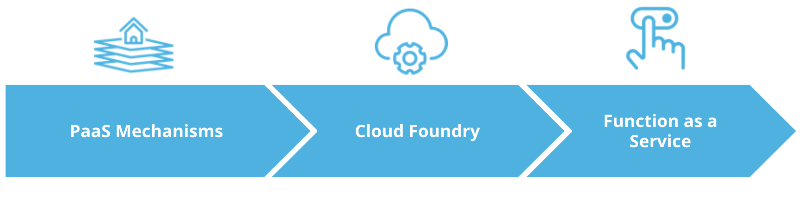

# Introduction

Plenty of smaller organization do not have the resources or a context to fully manage their infrastructure. In this case it make sense to delegate the creation and management of the platform to third parties.

In this lesson we will learn Platform as a Service or PaaS architecture

Throughout this lesson we will explore:

* PaaS Mechanisms
* Cloud Foundry
* Function as a Service
