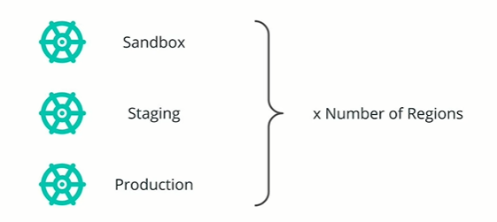
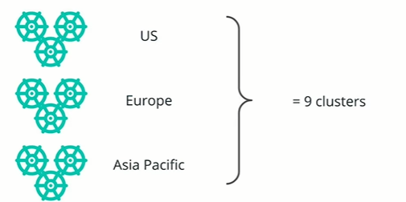

# Cluster Management

Kubernetes offers a great range of capabilities such as 

* Automation
* Portability
* Extensibility
* Flexibility
* Self-healing
* etc.

However, managing Kubernetes at scale is challenging, especially when the clusters are self-hosted in datacenters or private clouds.  In this case, a team has to keep up-to-date with the latest Kubernetes releases, to ensure the platform is updated, upgraded, managed, and configured to meet the production-grade standards.
**For example:** every single team operating Kubernetes will manage more than one cluster. Usually this will be distributed per development stages, such as

* Sandbox
* staging
* production

However it is also common to run the platform in different region to reduce the time to deliver the product to end-users.

As such, to ensure market proximity, these clusters are replicated across the regions.
**For example:** Distributing the infrastructure in US, Europe and Asia Pacific. In this simple scenario, a team will operate nine cluster, but this could increase to 10s or even 100s of clusters

Configuring, managing, upgrading, updating, and deploying to all of this cluster is challenging and often requires a dedicated team.

In these circumstances, if an organization does not have sufficient engineering resources, delegating the platform management to a 3rd party provider is a more suitable solution. This is covered by a PaaS or Platform as a Service solution.
