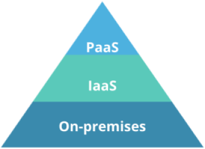
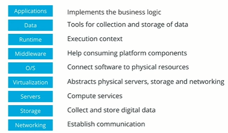
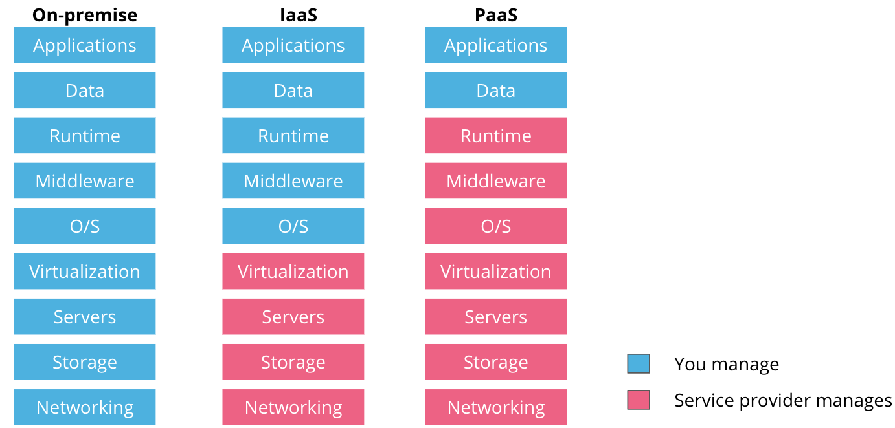
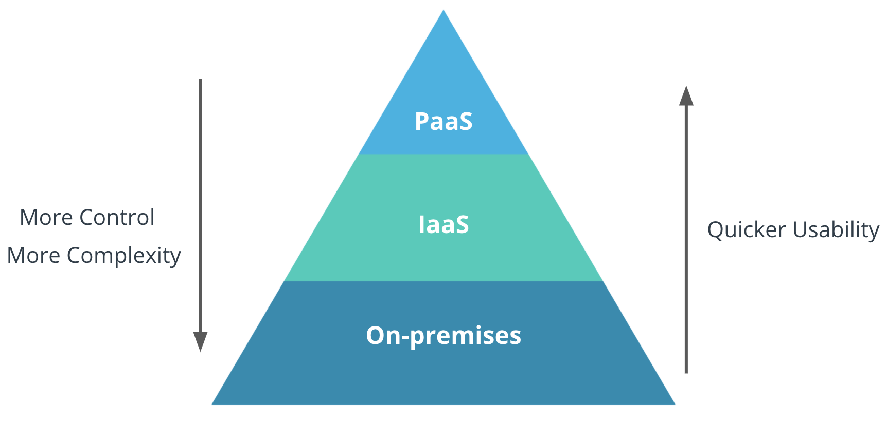

# PaaS Mechanisms

PaaS is cloud computing  mechanism where the application management is delegated to third party.

## Cloud Computing Services

Before deep diving into PaaS, lets loot out at all Cloud Computing Services

* **On-premise** - where an engineering team has full control over the platform, including the physical servers
* **IaaS** or **Infrastructure as a Service** - where a team consumes compute, network, and storage resources from a vendor
* **PaaS** or **Platform as a Service** - where the infrastructure is fully managed by a provider, and the team is focused on application deployment

## Infrastructure Services

Releasing a product to a production environment implies that a platform has been build to host this particular product. A platform consists of multiple services that need to be configured, wired, and maintained together. These services are:

<!--
 * **Networking** - establish communication between internal and external systems, such as internet connection, firewalls, routers, and cables
* **Storage**- collect and store digital data, such as files, blocks, or objects
* **Servers** - physical machines that provide compute services for a platform
* **Virtualization** - abstracts physical servers, storage, and networking. For example, we have learned that hypervisors are used to virtualize servers.
* **O/S** - operating systems that connect the software to physical resources (e.g. Linux, Ubuntu, Windows, etc.)
* **Middleware** - help the developers to build an application by making it easy to consume platform capabilities (e.g. messaging, API, data management)
* **Runtime** - execution context for an application. For example, using JVM (or Java Virtual Machine) as a Java runtime
* **Data** - tools for collection and storage of data that is required by an application during execution(e.g. MySQL, MongoDB, or CockroachDB)
* **Applications** - the business logic for a product
-->

### On-premise

On-premise represents a cloud-computing offering where the engineering team has full control of the platform services (from networking to applications). This solution is suitable for organizations that have sufficient engineering power and regulations that demand full control of their technology stack and operations within it.

### IaaS

IaaS solutions provide the abstraction of networking, storage, server, and virtualization layers. As a result, these services are consumed on-demand by the engineering teams. Additionally, IaaS provides a suitable abstraction for the management of self-hosted Kubernetes clusters, which depend on compute, network, and storage components for a successful bootstrap process.

The most common IaaS solutions are delivered by public cloud providers such as AWS, GCP, Microsoft Azure, and many more.

### PaaS

PaaS is a cloud-computing offering that enables an engineering team to fully focus on application development. It abstracts all services except the application and the data associated with it. As a result, the team is required to manage the code base and any database service that the product needs to be fully operational.

Popular PaaS solutions are App Engine from GCP, Heroku, Cloud Foundry, Beanstalk from AWS, and many more.

#### Pros and Cons of PaaS Mechanism

**Advantages:**

* Time-efficiency - engineering focus is shifter toward development rather than infrastructure management
* Scalability and high availability - on-demand resource consumption enables an application to easily scale and fail-over
* Rich application catalog - integration of external service (e.g. databases) with minimal effort

**Disadvantages:**

* Vendor lock-in - it is challenging to interchange PaaS providers without service disruption
* Data security - since data is managed by a 3rd party, an extra layer of complexity is added to ensure data confidentiality
* Operational limitations - the service catalog is limited to the services offered by the integrated cloud provider

## Cloud Services

As an organization grows and expands, it is important to evaluate the Cloud solutions that fit the business requirements closely. However, it is important to consider the following traits of cloud-computing services:

* The fewer components are delegated to external providers, the **more control** there is over available functionalities
* The more ownership there is across the stack, the **more complexity** is introduced in managing and delivering the product
* The fewer components are managed by an engineering team, the quicker is the **usability** of the stack. As such, with a PaaS offering the engineering team can deploy their application immediately. While if choosing an on-premise solution, the release of a product is possible only after the platform is built.

**New Terms:**

* **On-premise** - cloud-computing service, where a team owns the entire technology stack.
* **IaaS** - cloud-computing service that offers the abstraction of networking, storage, server, and virtualization layers.
* **PaaS** - cloud-computing service, where the infrastructure components are managed fully by a 3rd party provider, and a team manages only the application and the data associated with it.

**Further Reading:**
Read more about on-premise, IaaS, and PaaS solutions:

* [On Premise Vs Cloud](https://www.ebcgroup.co.uk/news-insights/on-premises-vs-cloud)
* [Infrastructure as a Service](https://susedefines.suse.com/definition/infrastructure-as-a-service/)
* [Platform as a Service](https://susedefines.suse.com/definition/platform-as-a-service/)
* [Cloud Computing in 2021: What You Should Know about Public, Private, Hybrid, PaaS, SaaS and FaaS](https://www.suse.com/c/cloud-computing-in-2021-what-you-should-know-about-public-private-hybrid-paas-saas-and-faas/)