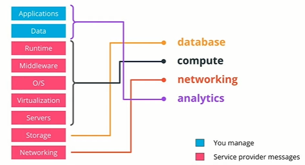

# Exercise: PaaS Mechanisms

## PaaS Consideration for a web-store

Platform as a Service (PaaS) provides a hosted environment for the efficient development and deployment of a project. Using this service truly allows developers to focus on building functionality instead of managing infrastructure components.

Imagine the following scenario: you are part of the small team that needs to refactor a web-store application. Currently, the application provides an inventory of thousands of products and is actively used by millions of customers daily. As a business, you want to guarantee service availability with minimal disruption during the refactoring/migration process. The application is managed in-house and is composed of front-end and backend microservices and a collection of databases to store the inventory and customer details.

The main reason for the refactoring process is the inability to cope with the high load of requests and poor end-user experience while using the web-store. Due to limited engineering resources, the aim is to introduce a new database solution and outsource the management to a 3rd party vendor. As well, the team desires to increase the visibility of the application by evaluating the monitoring and logging capabilities.

At this stage, you and your team decided that PaaS provides the most suitable solution. Using the above details, describe what PaaS functionalities will be highly beneficial for this project and elaborate on your reasoning.

**PaaS Considerations**
Describe what PaaS functionalities will be explicitly beneficial for this project and why?

**Ans:**

By default, the PaaS solutions offer the management of the underlying infrastructure, such as storage, databases, compute, hosting, and many more. Also, the majority of solutions will provide data analytics, security, and advanced scheduling.

As such, the web-store project will benefit from the following PaaS capabilities:

* database - for storing the customer details, orders, and products details
* compute - accessible scalability for the application to serve millions of customers
* networking - hosting and serving the requests with no downtime
* analytics - an add-on to collect data and provide metrics and logs about customer interaction with the web-store