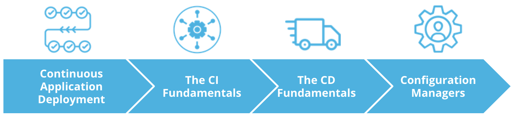

# Introduction

In this course we will explore how to deploy cloud native tooling to construct CI/CD pipeline.
We will deep dive into GitHub actions and ArgoCD as deployment mechanism and explorer template configuration managers such as **Helm** to enable the easy deployment of an application to multiple clusters.

Overall, in this lesson we will explore:

* Continuous Application Deployment
* The CI Fundamentals
* The CD Fundamentals
* Configuration Managers
