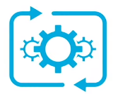
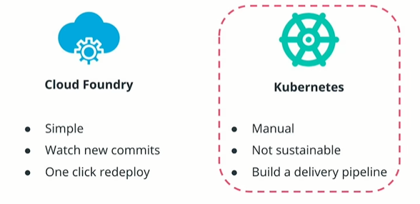

# Big Picture: Application Releases

Up to this stage, we have practiced the packaging of an application using Docker and its deployment to a Kubernetes cluster using kubectl commands. Also we have deployed an application using **Cloud Foundry** in a use case where PaaS is a suitable option for a team.

The next step is to fully automate the release process for existing and new features.

## Cloud foundry

* With PaaS offering, releasing the new feature is **simple**.
* In case of Cloud Foundry, the Git repository with the source code is always **watched.**
* When a new commit is available, the user can **redeploy** the application with the **click of a button.**

## Kubernetes

* In case of releasing an application to Kubernetes cluster, you have to **manually** type all Docker and Kubectl commands.
* This is not **sustainable**, especially if you have dozens of releases a day and you need to build, text and execute every release.
* You need to build a delivery pipeline that will automate all these operations.

**Note:** Every PaaS offering such as Heroku, Beanstalk, Cloud Foundry has a specific way of releasing an application

In this lesson, we will focus on building a delivery pipeline to deploy to a Kubernetes cluster to completely automate the process using cloud native tooling and

