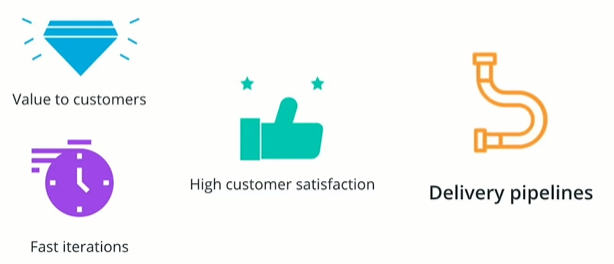
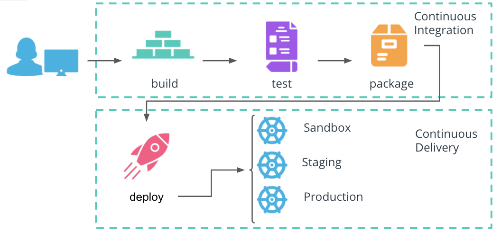
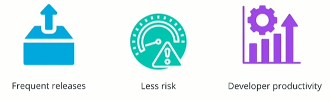

# Continuous Application Deployment

## Business Goal

Every company has the same goal: to deliver value to customers and maintain customer satisfaction. To achieve this, an organization needs to be fast in integrating customer feedback and release new features.

It is possible to manually deploy every release for a small product. However, this is not viable for a product that has thousands of microservices developed by hundreds of engineers. A delivery pipeline is essential for continuous and automated deployment of new functionalities.

The delivery pipeline should include following stages:

* Build
* Test
* Package
* Deploy

The new changes should proceed through all following stages of the pipeline to reach the end-users:

* **Build** - It triggered when the developer pushes a new commit. It compile the application source code and its dependencies. If this stage fails the developer should address it immediately as there might be missing dependencies or errors in the code.
* **Test** - run a suite of tests, such as unit testing, integration, UI, smoke, or security tests. These tests aim to validate the behavior of the code. If this stage fails, then developers must correct it to prevent dysfunctional code from reaching the end-users.
* **Package** - create an executable that contains the latest code and its dependencies. This is a runnable instance of the application that can be deployed to end-users.
* **Deploy** - push the packaged application to one or more environments, such as sandbox, staging, and production. Usually, the sandbox and staging deployments are automatic, and the production deployment requires engineering validation and triggering.

It is common practice to push an application through multiple environments before it reaches the end-users. Usually, these are categorized as follows:

* Sandbox - development environment, where new changes can be tested with minimal risk.
* Staging - an environment identical to production, and where a release can be simulated without affecting the end-user experience.
* Production - customer-facing environment and any changes in this environment will affect the customer experience.

Overall, a delivery pipeline consists of two phases:

* **Continuous Integration** (or CI) includes the **build**, **test**, and **package** stages.
* **Continuous Delivery** (or CD) handles the **deploy** stage.

## Advantages of a CI/CD pipeline

* Frequent releases - automation enables engineers to ship new code as soon as it's available and improves responsiveness to customer feedback.
* Less risk - automation of releases eliminates the need for manual intervention and configuration.
* Developer productivity - a structured release process allows every product to be released independently of other components

**New Terms:**

* **Continuous Integration** - a mechanism that produces the package of an application that can be deployed.
* **Continuous Delivery** - a mechanism to push the packaged application through multiple environments, including production.
* **Continuous Deployment** - a procedure that contains the Continuous Integration and Continuous Delivery of a product.

Further Reading
Explore the CI/CD mechanism in more detail:

* [CI/CD: Continuous Integration & Delivery Explained](https://semaphoreci.com/cicd)
* [What’s the Difference Between Continuous Integration, Continuous Deployment and Continuous Delivery?](https://semaphoreci.com/blog/2017/07/27/what-is-the-difference-between-continuous-integration-continuous-deployment-and-continuous-delivery.html)
