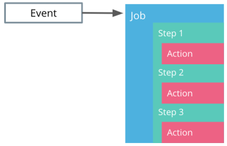

# The CI Fundamentals

Continuous Integration (CI) is a mechanism that produces the package of an application that can be deployed to consumers. As such, every commit to the main branch is built, tested, and packaged, if it meets the expected behavior. Within the cloud-native, the result of Continuous Integration represents a Docker image or an artifact that is OCI compliant.

Let's explore the commands and tools associated with each Continuous Integration stage!


**Build Stage:** (Occurs inside the Dockerfile)

The build stage compiles the application source code and associated dependencies. We have explored this stage as part of the Dockerfile. For example, the Dockerfile for the Python hello-world application instructed the installation of dependencies from _requirements.txt_ file and execution of the _app.py_ at the container start.

``` dockerfile
# use pip to install any application dependencies 
RUN pip install -r requirements.txt

# execute command  on the container start
CMD [ "python", "app.py" ]
```

**Test:**

An engineering team can implement the test stage by using some of the well-known Python Frameworks.

* [pytest](https://docs.pytest.org/en/stable/) - for functional testing of the application
* [pylint](https://pypi.org/project/pylint/) - for static code analysts of the application codebase

**Package:**

The result of the package stage is an executable that contains the latest features and their dependencies. With Docker, this stage is implemented using docker build and docker push commands. These create a Docker image using a Dockerfile, and stores the image to a registry, such as DockerHub. For example, to create and store the image for Python hello-world application, the following commands are used:

``` dockerfile

# build an image using a Dockerfile
docker build -t python-helloworld .

# store and distribute an image using DockerHub
docker push pixelpotato/python-helloworld:v1.0.0
```

_**Note**_: Buildpacks does not require a Dockerfile to create an OCI compliant image or artifact. Where as docker will be dependent on a Dockerfile.

## GitHub Actions

There are plenty of tools that automate the Continuous Integration stages, such as Jenkins, CircleCI, Concourse, and Spinnaker. However, in this lesson, we will explore GitHub Actions to build, test, and package an application.

GitHub Actions are:

* **Event-driven** workflows that can be executed when 
  * A new commit is available
  * When an external event happens
  * On predetermined schedule events.

For CI, GitHub Actions are used ton build and test the code. This provides immediate response whenever a commit passes the quality check.

GitHub Actions offers:

* Support for multiple languages and frameworks
* Tailored Notification
* Status badges for a project, such as whenever a workflow has

GitHub Action Structure:

A GItHub action is constructed of one or more jobs. A job contains a sequence of steps that execute standalone commands, known as actions.

passed or failed.

Let's configure a GitHub Action that prints the Python version!

GitHub Actions are configured using YAML syntax, hence uses the `.yaml` or `.yml` file extensions. These files are stored in `.github/workflows` directory within the code repository. Within this folder, the `python-version.yml` contains the following sections:

``` yaml

## file location and name: # .github/workflows/python-version.yml

##  Named of the workflow.
name: Python version
## Set the trigger policy.
## In this case, the workflow is execute on a `push` event,
## or when a new commit is pushed to the repository
on: [push]
## List the steps to be executed by the workflow
jobs:
  ## Set the name of the job
  check-python-version:
    ## Configure the operating system the workflow should run on.
    ## In this case, the job on Ubuntu
    runs-on: ubuntu-latest
    ## Define a sequence of steps to be executed 
    steps:
      ## Use the public `checkout` action in version v2  
      ## to checkout the existing code in the repository
      - uses: actions/checkout@v2
      ## Use the public `setup-python` action  in version v2  
      ## to install python on the  Ubuntu based environment 
      - uses: actions/setup-python@v2
      ## Executes the `python --version` command
      - run: python --version
```

On the successful execution of the workflow, the Python version is printed. For example, `Python 3.9.0.`

### GitHub Actions Walkthrough

_Note:_ To follow this demo make sure you fork the [course repository](https://github.com/udacity/nd064_course_1) and reference the [python-helloworld application](https://github.com/udacity/nd064_course_1/tree/main/solutions/python-helloworld).

This demo provides a step-by-step guide of how to write a GitHub Action to run a suite of pytests.

Pytest is a framework that is used to write functional testing for an application. In this example, within the [test_with_pytest.py](https://github.com/udacity/nd064_course_1/blob/main/solutions/python-helloworld/test_with_pytest.py) we create a mock test that will always execute successfully.

``` python

## Define a test that will always pass successfully
def test_always_passes():
    assert True
```

Once we have completed writing the test, we can construct a GitHub Action that will execute the tests using `pytest` tool. For this purpose, a new workflow is defined in the [pytest.yml](https://github.com/udacity/nd064_course_1/blob/main/.github/workflows/pytest.yml) file within the `.github/workflows directory`.

To trigger the workflow a new commit is necessary (e.g. editing the README.md fie). On the successful execution of the GitHub Action, we should see an output mentioning that all the test passed successfully (as expected):

``` bash

Run pytest
============================= test session starts ==============================
platform linux -- Python 3.8.6, pytest-6.2.1, py-1.10.0, pluggy-0.13.1
rootdir: /home/runner/work/nd064_course_1/nd064_course_1
collected 1 item

solutions/python-helloworld/test_with_pytest.py .                        [100%]

============================== 1 passed in 0.02s ===============================
```

Also, this demo showcases the "Python version" GitHub Action that was used as an example in the slides.

**Further reading:**
Explore GitHub Actions in more detail:

* [Introduction to GitHub Actions](https://docs.github.com/en/actions/learn-github-actions/introduction-to-github-actions)
* [Create an example workflow](https://docs.github.com/en/actions/learn-github-actions/introduction-to-github-actions#create-an-example-workflow)
* Inspect public workflows on [GitHub Marketplace](https://github.com/marketplace?type=actions)
