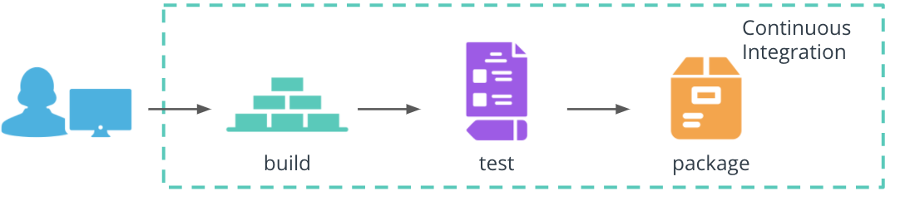

# The CI Fundamentals

Continuous Integration (CI) is a mechanism that produces the package of an application that can be deployed to consumers. As such, every commit to the main branch is built, tested, and packaged, if it meets the expected behavior. Within the cloud-native, the result of Continuous Integration represents a Docker image or an artifact that is OCI compliant.

Let's explore the commands and tools associated with each Continuous Integration stage!



## Build

The build stage compiles the application source code and associated dependencies. We have explored this stage as part of the Dockerfile. For example, the Dockerfile for the Python hello-world application instructed the installation of dependencies from requirements.txt file and execution of the app.py at the container start.

``` dockerfile
# use pip to install any application dependencies 
RUN pip install -r requirements.txt

# execute command  on the container start
CMD [ "python", "app.py" ]
```

## Test

The technology landscape provides an abundance of frameworks, libraries, and tools to test and validate the behavior of an application. For Python application, some of the well-known frameworks are:

**Package**

The result of the package stage is an executable that contains the latest features and their dependencies. With Docker, this stage is implemented using docker build and docker push commands. These create a Docker image using a Dockerfile, and stores the image to a registry, such as DockerHub. For example, to create and store the image for Python hello-world application, the following commands are used:

``` dockerfile

# build an image using a Dockerfile
docker build -t python-helloworld .

# store and distribute an image using DockerHub
docker push pixelpotato/python-helloworld:v1.0.0
```

_**Note**_: Buildbacks does not require a Dockerfile to create an OCI compliant image or artifact.

* [pytest](https://docs.pytest.org/en/stable/) - for functional testing of the application
* [pylint](https://pypi.org/project/pylint/) - for static code analysts of the application codebase
