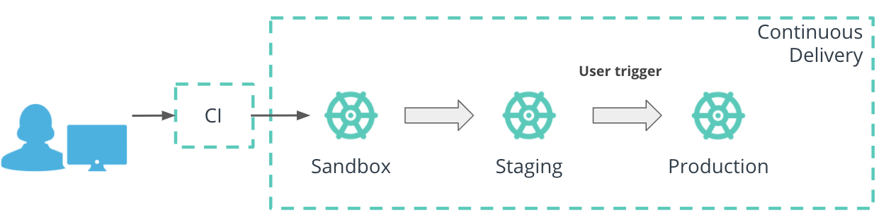

# The CD Fundamentals

When an engineering team has a package with latest core changes, they will rarely release it to customer straight away. It is a common practice to test the application beforehand in a development setup such as sandbox or a staging. Only when the application meets the excepted behavior, it is deployed to a customer-facing environment.

The process of propagating an application through multiple environments, until it reached the end-users, is known as the **Continuous Delivery** (or CD) stage.

It is common practice to push the code through at least 3 environments: sandbox, staging, and production. A reminder of each environment's purpose :

* Sandbox - development environment, where new changes can be tested with minimal risk.
* Staging - an environment identical to production, and where a release can be simulated without affecting the end-user experience.
* Production - customer-facing environment and any changes in this environment will affect the customer experience.



The sandbox and staging environments are fully automated, meaning that if the deployment to sandbox is successful and meets the expected behavior, then the code will be propagated to the staging automatically.
However, the push to the production requires engineering validation and triggering as this is the environment that the end-users will interact with.

**Note:** It is not worthy that the production deployment can be fully automated, only if there is high confidence that the code will not introduce customer-facing disruptions.

Within the deployment pipeline, Continuous Delivery covers the **deploy** stage. Throughout this course, we have practiced the deployment of an application while using `kubectl` commands.

Kubernetes CLI (kubectl), support the management of imperative and declarative configuration. With the imperative approach, a Python hello-world application is deployed by creating a Deployment resource and referencing the desired Docker image:

``` bash

# deploy `python-helloworld` using the imperative approach 
kubectl create deploy python-helloworld --image=pixelpotato/python-helloworld:v1.0.0
```

On the other side, with the declarative approach, the Python hello-world Deployment is store in a YAML manifest and is created using the `kubectl apply` command:

``` bash

# deploy `python-helloworld` using the declarative approach
kubectl apply -f deployment.yaml
```

_Note:_ The declarative approach is the recommended way to deploy resources within a production environment. Hence, this configuration management technique will be referenced in the next sections.

## Argo CD

Within the ecosystem, multiple tools support the automation of CD such as Jenkins, CircleCI, Concourse, and Spinnaker. However, in this lesson, we will explore ArgoCD to propagate an application to multiple Kubernetes clusters.

ArgoCD is a declarative Continuous Delivery tool for Kubernetes, which follows the GitOps patterns.

* The declarative principle refers to the fact that the application and environment **configuration should stored in manifest**.
* This facilitates a **replicable** and **reliable** process for resource deployment.

* The GitOps pattern refers to using **Git repositories as source of truth** for defining the desired state of an application. As such, ArgoCD will continuously watch Git repositories and identify any changes from the latest deployed commit.
* These changes can be **reconciled automatically or manually**.

### ArgoCD Advantages

* It offers an **automatic deployment** to target environments,
* Support for **multiple configuration management tools** such as plane YAML, Helm, Customize
* Deployment to **multiple clusters**, 
* **Automatic identification** of new commits and their **reconciliation**.

**Note:** For application deployment through multiple environments, ArgoCD provides CRDs (Custom Resource Definitions) to configure and manage the application release.

### ArgoCd Resources

ArgoCD has a couple or core Kubernetes resources to manage Continuous Delivery, projects and applications.

#### Project resource

The Project resource is a CRD that provides a logical grouping of applications, including access to source and destination repositories, and permissions to resources within the cluster. This resource is handy to segregate and control the deployment to multiple clusters.

#### Application resource

The Application resource that stores the configuration of how an application should be deployed and managed.
Let's explore how a Python hello-world application is deployed using an ArgoCD Application resource: Note: It is assumed that the declarative manifests for Python hello-world are available ((e.g. deploy.yaml, service.yaml, etc).

``` yaml

## API endpoint used to create the Application resource
apiVersion: argoproj.io/v1alpha1
kind: Application
## Set the name of the resource and namespace where it should be deployed.
## In this case the Application resource name is set to  `python-helloworld `
## and it is deployed in the `argocd` namespace
metadata:
  name: python-helloworld 
  namespace: argocd
spec:
  ## Set the target cluster and namespace to deploy the Python hello-world application.
  ## For example, the Python hello-world application is deployed in the `default` namespace
  ## within the local cluster or `https://kubernetes.default.svc`
  destination:
    namespace: default
    server: https://kubernetes.default.svc
  ## Set the project the application belongs to.
  ## In this case the `default` project is used.
  project: default
  ## Define the source of the Python hello-world application manifests.
  ## In this example, the manifests are stored in the `argocd-demo` repository
  ## under the `python-manifests` folder. Additionally, the latest commit within
  ## the repository is targeted or `HEAD`.
  source:
    path: python-manifests
    repoURL:
    https://github.com/kgamanji/argocd-demo
    targetRevision: HEAD
  # # Set the sync policy. 
  ## If left empty, the sync policy will default to manual.
  syncPolicy: {}
```

**App of Apps:**


ArgoCD provides an “app-of-apps” technique that enables a group of applications to be deployed and configured together. This technique is useful if a product is developed using a microservice-based architecture, and a single point of orchestration is necessary to deploy all microservices. For example, a Web-store Application CRD can be used to manage the Application CRDs for the UI, Login, and Payment units. In this case, one point of control is provisioned to release and manage multiple microservices.

**New Terms:**

* **GitOps** - an operating model that refers to the Git repositories as the source of truth for declarative infrastructure and applications.

Further Reading
Explore the GitOps pattern and ArgoCD resources:

[A Guide To GitOps](https://www.weave.works/technologies/gitops/)
[ArgoCD Project CRD](https://argoproj.github.io/argo-cd/operator-manual/declarative-setup/#projects)
[ArgoCD Application CRD](https://argoproj.github.io/argo-cd/operator-manual/declarative-setup/#applications)
